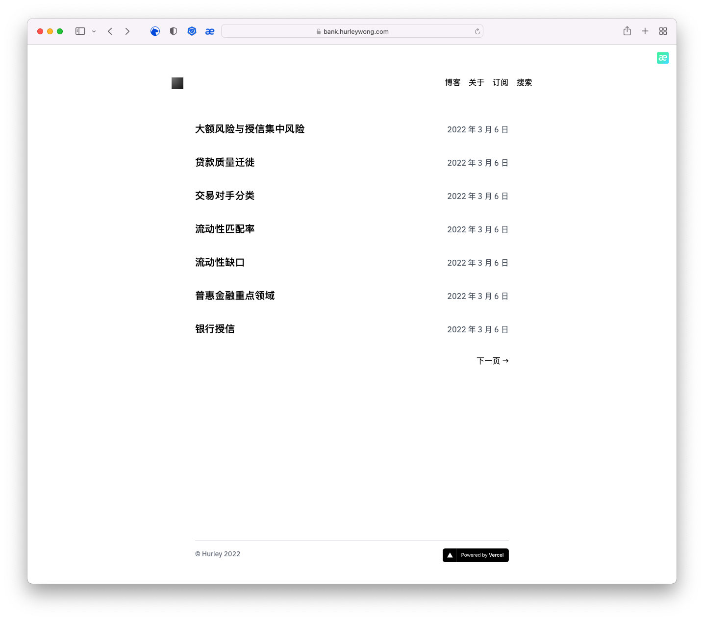

# notion-bank-hurley

使用 [nobelium](https://github.com/craigary/nobelium) 模版，搭配 Notion 创建的[银行小课堂](https://bank.hurleywong.com/)



## Quick Start

- Star this repo 😉
- Duplicate [this Notion template](https://craigary.notion.site/adc3552cfc73442ab5048d4b1eb0079a), and share it to the public
- [Fork](https://github.com/craigary/nobelium/fork) this project
- Customize `blog.config.js`
- _(Optional)_ Replace `favicon.svg`, and `favicon.ico` in `/public` folder with your own
- Deploy on [Vercel](https://vercel.com), set following environment variables：
  - `NOTION_PAGE_ID` (Required): The ID of the Notion page you previously shared to the web, usually has 32 digits after your workspace address
  - `NOTION_ACCESS_TOKEN` (Optional, not recommended): If you decide not to share your database, you can use token to let Nobelium grab data from Notion database. You can find it in your browser cookies called `token_v2`
    - Keep in mind Notion token is only valid for 180 days, make sure to update manually in vercel dashboard, we probably switch to Official API to resolve this issue in the future. Also, images in Notion database will not properly rendered
- **That's it!** Easy-peasy?

<details><summary>Wait for a sec, what is Page ID？</summary>
  
</details>

## Play With Docker

Unofficial, thanks to [@Vaayne](https://github.com/craigary/nobelium/pull/157)'s work!

### Build Docker image yourself
```
# set env
export NOTION_PAGE_ID=xxx # your NOTION_PAGE_ID
export IMAGE=nobelium:latest

# build with docker
docker build -t ${IMAGE} --build-arg NOTION_PAGE_ID .

# run with docker
docker run -d --name nobelium -p 3000:3000 -e NOTION_PAGE_ID=${NOTION_PAGE_ID} nobelium:latest
```

### Use default docker image
```
# pull image
docker pull ghcr.io/craigary/nobelium:main

# run with docker
docker run -d --name nobelium -p 3000:3000 -e NOTION_PAGE_ID=${NOTION_PAGE_ID} ghcr.io/craigary/nobelium:main
```

## Technical details

- **Generation**: Next.js and Incremental Static Regeneration
- **Page render**: [react-notion-x](https://github.com/NotionX/react-notion-x)
- **Style**: Tailwind CSS and `@tailwindcss/jit` compiler
- **Comments**: Gitalk, Cusdis and more

## License

The MIT License.
